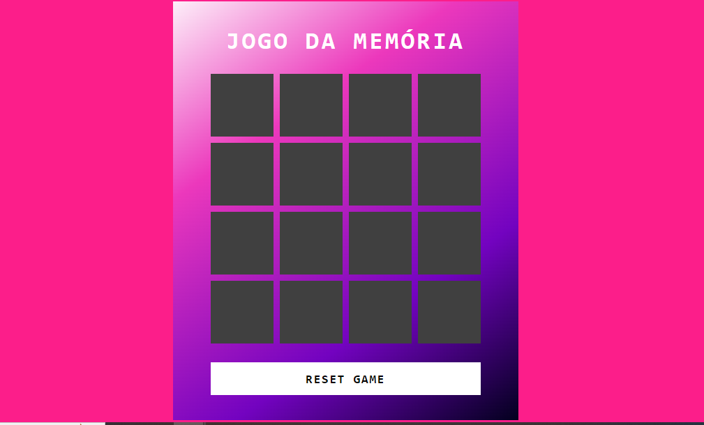

# Jogo de memória
O jogo consiste em mostrar uma emoji e o jogador terá que encontrar o seu par.

## Linguagem utilizada
Utilizei javascript puro para essa demostração

## Técnicas utilizadas
No CSS técnicas que posso destacar são as de transições, por exemplo:
```
transition: 0.25s;
transform: rotateY(0deg);
backface-visibility: hidden;
backface-visibility: hidden;
```

No javascript as técnicas que pode se destacar são os arrays para guardar os emojis.
Comandos ramdômicos e manipulação de DOM

